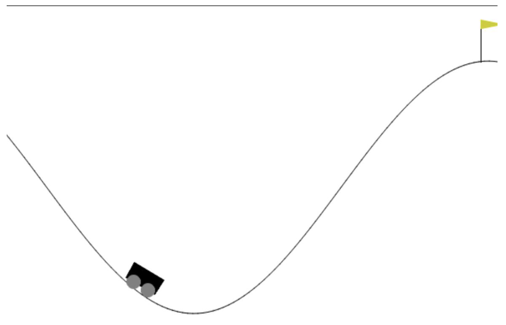
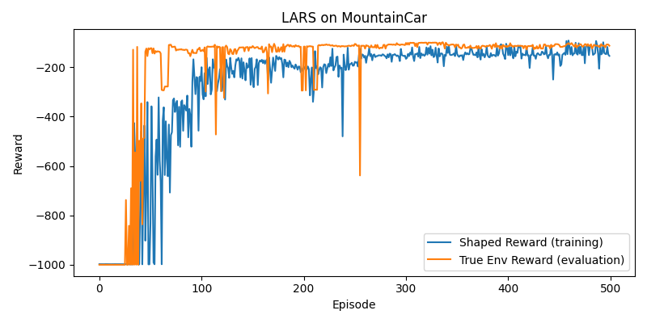
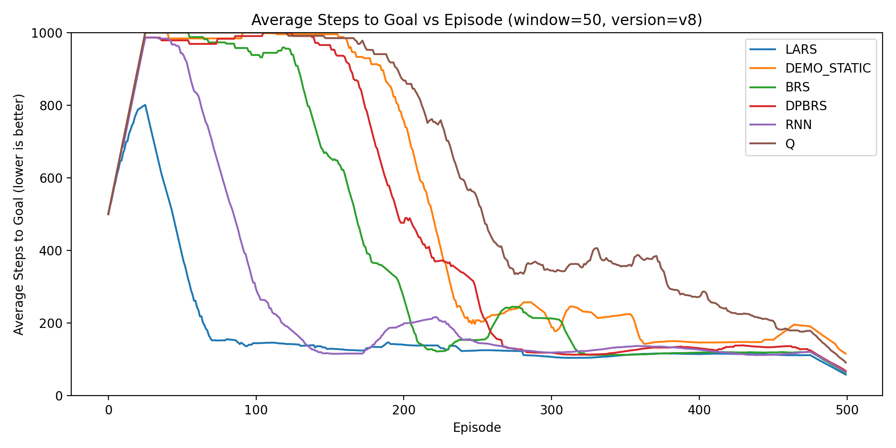
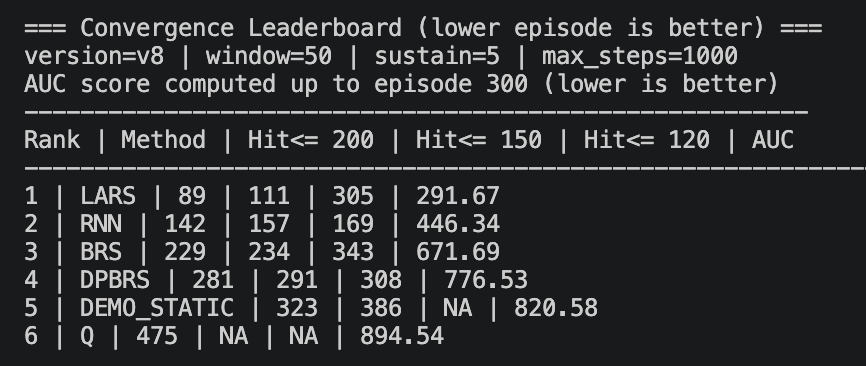

# LARS MountainCar Research

This project compares several reward-shaping and reinforcement-learning methods on
`MountainCar-v0` from Gymnasium. The main experiment trains a tabular Q-learning
baseline, uses that baseline to generate demonstrations, and compares multiple
deep RL reward-shaping methods by plotting and ranking how quickly they reduce
the number of steps needed to reach the goal.



## Methods Compared

- `q_only`: tabular Q-learning baseline.
- `lars`: adaptive demonstration-based reward shaping.
- `demo_static`: demonstration-based shaping with a decaying/static potential.
- `brs`: baseline reward shaping with a fixed potential and alpha decay.
- `dpbrs`: dynamic potential-based reward shaping from the agent's own rollouts.
- `rnn`: recurrent potential model using a GRU-based shaping network.

## Project Structure

```text
.
├── README.md
├── .gitignore
├── images/                         # README figures and result screenshots
└── test/
    ├── train_comparison_methods.py   # main training and visualization script
    ├── run_all.py                    # runs Q baseline plus all comparison methods
    ├── plot_steps_comparison.py      # plots steps-to-goal comparison curves
    ├── leaderboard_steps.py          # ranks methods from saved reward arrays
    └── models/                       # saved models, rewards, and plots
```

The current workflow does not need the older standalone `lars_v1.py` or
`q_mountaincar.py` scripts. Their functionality has been folded into
`train_comparison_methods.py`.

## Setup

Use Python 3 with these main packages:

```bash
pip install gymnasium numpy matplotlib torch
```

If you want to use the existing virtual environment in this folder:

```bash
source .venv/bin/activate
```

Run all commands below from the `test/` directory because the scripts save and
load experiment outputs from the relative `models/` path.

```bash
cd test
```

## Full Experiment

Train the Q baseline, train every comparison method, and create the comparison
plot for a new version:

```bash
python run_all.py --version v9 --plot
```

This runs:

1. `q_only`, which saves the tabular Q model and Q reward history.
2. `lars`, `demo_static`, `brs`, `dpbrs`, and `rnn`.
3. The steps comparison plot.

To skip retraining the Q baseline when the Q model already exists:

```bash
python run_all.py --version v9 --skip_q --plot
```

To only regenerate the comparison plot from existing saved rewards:

```bash
python run_all.py --version v9 --skip_train --plot
```

## Train One Method

Train only the tabular Q baseline:

```bash
python train_comparison_methods.py --method q_only --version v9 --train
```

Train one deep comparison method:

```bash
python train_comparison_methods.py --method lars --version v9 --train --q_demo_path models/q/mountain_car_v9.pkl
```

Valid methods are:

```text
lars, demo_static, brs, dpbrs, rnn, q_only
```

Example LARS training curve:



## Visualize A Trained Agent

Visualize a trained deep method:

```bash
python train_comparison_methods.py --method lars --version v9 --visualize
```

Visualize the Q baseline:

```bash
python train_comparison_methods.py --method q_only --version v9 --visualize
```

Rendering opens Gymnasium's human render window, so it may require the right
local display support.

## Plot Results

Create a smoothed steps-to-goal plot from saved reward files:

```bash
python plot_steps_comparison.py --version v9 --window 50 --max_steps 1000
```

Custom output path:

```bash
python plot_steps_comparison.py --version v9 --out models/comparison_steps_v9.png
```

The plot converts MountainCar rewards to approximate steps using:

```text
steps = -reward
```

Lower curves are better.

Example comparison plot:



## Leaderboard

Rank methods by convergence speed and area under the smoothed steps curve:

```bash
python leaderboard_steps.py --version v9
```

Useful options:

```bash
python leaderboard_steps.py --version v9 --window 50 --thresholds 200,150,120 --sustain 5 --auc_upto 300
```

The leaderboard reports:

- first episode where smoothed steps stay below each threshold,
- AUC-style mean steps score over early training,
- which reward files were used.

Example leaderboard output:



## Saved Outputs

Training writes files under `test/models/`.

Q baseline:

```text
models/q/mountain_car_v9.pkl
models/q/q_rewards_v9.npy
models/q/q_training_v9.png
```

Deep methods:

```text
models/lars/lars_model_v9.pth
models/lars/lars_shaped_v9.npy
models/lars/lars_true_v9.npy
models/lars/lars_training_v9.png
```

The same naming pattern is used for:

```text
demo_static, brs, dpbrs, rnn
```

Comparison plot:

```text
models/comparison_steps_v9.png
```

## How The Pipeline Works

1. The tabular Q baseline discretizes MountainCar position and velocity, trains a
   Q-table, and saves it as a `.pkl` file.
2. Demonstration-based methods load that Q-table and collect greedy
   demonstration trajectories.
3. A potential network learns state potentials from demonstration returns or
   rollout returns, depending on the method.
4. The environment is wrapped with reward shaping:

   ```text
   shaped_reward = env_reward + alpha * (gamma * Phi(next_state) - Phi(state))
   ```

5. A DQN agent trains with shaped rewards.
6. Each episode also evaluates the policy using true environment reward, so the
   final comparison is based on real task performance rather than shaped reward.
7. Plotting and leaderboard scripts read the saved true reward arrays and compare
   methods by steps-to-goal.

## Notes

- Use unique version names like `v9`, `v10`, etc. to avoid overwriting old runs.
- The `.npy` true reward files are the key files for plots and leaderboards.
- The `.pth` files are needed only if you want to visualize or reload trained
  neural agents.
- The `.pkl` Q model is needed for demonstration-based methods using the same
  version.
